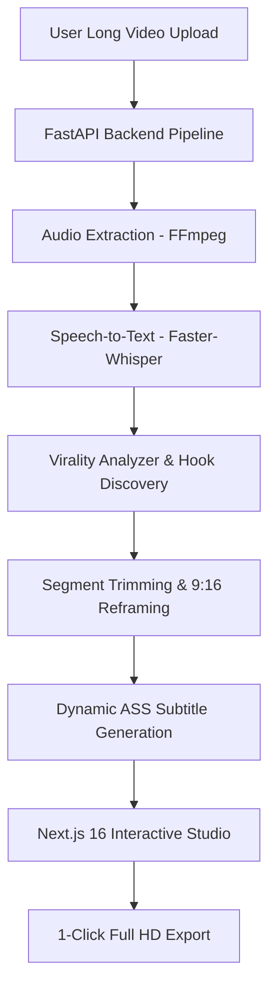

# ⚡ ClipGenR AI 2.0
> **Automated Viral Shorts, Reels & TikTok Generator from Long-Form Videos**

Turn a single 60-minute long video or podcast into **10 high-converting, viral vertical short clips** in seconds with word-level speech recognition, 7-factor virality scoring, smart 9:16 re-framing, and dynamic Hormozi-style animated karaoke captions.

---

## 🌟 Key Features

- **🎙️ Word-Level Speech Recognition (Free & Offline)**
  - Powered by local `faster-whisper` extracting millisecond-accurate word timestamps with zero API key dependencies.
  - Optional seamless cloud routing to **Google Gemini 1.5 Flash** or **OpenAI Whisper-1** for studio perfection.
- **🔥 7-Factor AI Virality Scoring Engine**
  - Evaluates clips across **Hook Strength**, **Emotional Resonance**, **Info Density**, **Standalone Coherence**, **Shareability**, **Curiosity Gap**, and **Optimal Duration** (30–55s).
  - Automatically identifies scroll-stopping hooks and generates click-worthy dynamic titles.
- **📱 Smart 9:16 Vertical Re-Framing**
  - Automatically converts horizontal (16:9 / 4:3) videos to vertical (9:16) format with dynamic Gaussian blur background framing using FFmpeg hardware acceleration.
- **✨ Hormozi-Style Dynamic Karaoke Captions**
  - Word-by-word active highlight pop animation in vibrant Gold, Cyan, Green, and Rose Red.
  - 4 built-in aesthetic presets: *Hormozi Viral*, *Beast Pop*, *Neon Cyber*, and *Clean Minimalist*.
- **🇮🇳 Full Hindi & Hinglish Transliteration Engine**
  - Instant toggle between **Hinglish (English alphabet)** (e.g. *`HRITHIK JI AUR SHWETA AAP DONO KO SHADI...`*) and **Hindi (Devanagari)** (e.g. *`ऋतिक जी और श्वेता आप दोनों को शादी...`*).

- **🎛️ Interactive Real-Time 9:16 Studio Editor**
  - Live mobile phone bezel preview simulator with interactive video scrubbing.
  - Click-to-jump word transcript navigation.
  - Customize caption position (*Top*, *Center*, *Bottom*), font size, and active karaoke color with 1 click.
- **🚀 1-Click 1080x1920 60FPS Full HD MP4 Export**
  - Burns styled ASS subtitles directly into video frames for high-definition social media export.

---

## 🏗️ Architecture & Tech Stack



### **Frontend**
- **Framework**: Next.js 16 (Turbopack) with React 19 & TypeScript
- **Styling**: Tailwind CSS, Glassmorphism design system, Dark mode UI
- **Components**: Drag-and-drop video uploader, interactive 9:16 video studio, live karaoke subtitle renderer

### **Backend**
- **Framework**: FastAPI with Python 3.14 (Async lifespan)
- **Database**: SQLite with SQLAlchemy 2.0 ORM
- **AI Engines**: `faster-whisper` (CTranslate2), `indic-transliteration`, Google Gemini / OpenAI adapters
- **Video Engine**: FFmpeg (Stream copy, ASS subtitle burn-in, vertical aspect ratio filter)

---

## ⚡ Quick Start Guide

### 1. One-Click Launch (Windows)
Double-click the included batch launcher:
```bat
start_all.bat
```
*This launches both the FastAPI Backend (`http://127.0.0.1:8000`) and the Next.js Frontend (`http://localhost:3000`) and opens your browser automatically.*

---

### 2. Manual Start

#### **Backend Setup**
```bash
# Navigate to project root
cd "Automated Content Creation"

# Activate Virtual Environment
.\backend\venv\Scripts\activate

# Install Dependencies (if not already installed)
pip install -r backend/requirements.txt

# Start Backend Server
python run_backend.py
```
*Backend runs at `http://127.0.0.1:8000` (Swagger docs available at `http://127.0.0.1:8000/docs`).*

#### **Frontend Setup**
```bash
# Navigate to frontend folder
cd frontend

# Install Dependencies (if not already installed)
npm install

# Start Dev Server
npm run dev
```
*Frontend runs at `http://localhost:3000`.*

---

## 📁 Project Directory Structure

```
Automated Content Creation/
├── backend/
│   ├── app/
│   │   ├── api/             # FastAPI routers & endpoints (videos, clips, presets, auth)
│   │   ├── core/            # Config, database engine, logging, security
│   │   ├── models/          # SQLAlchemy ORM models (Video, Clip, Transcript, User)
│   │   ├── schemas/         # Pydantic validation schemas
│   │   └── services/
│   │       ├── ai/          # Faster-Whisper, Gemini & Viral Hook Analyzer
│   │       ├── caption/     # Subtitle generator (.ass) & Hinglish transliteration
│   │       ├── pipeline/    # End-to-end background processing orchestrator
│   │       ├── storage/     # Chunked streaming local & S3 storage
│   │       └── video/       # FFmpeg video processing & subtitle burn-in
│   ├── requirements.txt     # Python backend dependencies
│   └── tests/               # Automated unit tests (pytest)
├── frontend/
│   ├── src/
│   │   ├── app/             # Next.js App Router (pages, layout, globals.css)
│   │   ├── components/      # UI components (UploadModal, ClipEditorModal, ClipsList, Navbar)
│   │   ├── services/        # Direct HTTP API client
│   │   └── types/           # TypeScript interfaces
│   ├── package.json
│   └── tailwind.config.ts
├── storage_data/            # Local media storage (videos, audio, thumbnails, exports)
├── run_backend.py           # Backend server entrypoint
├── start_all.bat            # 1-click startup batch script
└── README.md
```

---

## ⚙️ Configuration (`.env`)

You can customize runtime settings in `backend/.env` or system environment variables:

| Variable | Default | Description |
| :--- | :--- | :--- |
| `PROJECT_NAME` | `ClipGenR AI` | Application Name |
| `DATABASE_URL` | `sqlite:///./clipforge.db` | Database connection string |
| `STORAGE_LOCAL_DIR`| `./storage_data` | Directory for uploaded videos & exports |
| `OPENAI_API_KEY` | *(Optional)* | For OpenAI Whisper-1 cloud transcription |
| `GEMINI_API_KEY` | *(Optional)* | For Google Gemini 1.5 Flash virality analysis |
| `WHISPER_MODEL_SIZE`| `base` | Local Faster-Whisper model size (`base`, `small`) |

---

## 🧪 Testing

Run backend test suite:
```bash
.\backend\venv\Scripts\python.exe -m pytest backend/tests/test_pipeline.py
```

Run frontend linter:
```bash
cd frontend && npm run lint
```

---

## 📄 License
MIT License. Built for content creators, agencies, and social media growth hackers.
